  <picture>
    <source media="(prefers-color-scheme: dark)" srcset="./dark.svg">
    <source media="(prefers-color-scheme: light)" srcset="./light.svg">
    
  </picture>

<!--
PROFILE DATA — replace only with facts you can verify.
Delete any field/section you do not use.

YOUR_NAME:
PROFESSIONAL_HEADLINE:
PRIMARY_ROLE:
SECONDARY_ROLE:
SPECIALIZATION:
CORE_FOCUS_01:
CORE_FOCUS_02:
CURRENT_PROJECT_OR_THEME:
TECH_01:
TECH_02:
TECH_03:
TECH_04:
PROJECT_01:
PROJECT_02:
PROJECT_03:
GITHUB_URL:
LINKEDIN_URL:
PORTFOLIO_URL:
EMAIL:
-->

## About

`YOUR_NAME` — `PROFESSIONAL_HEADLINE`

> Replace this short introduction with 1–3 factual sentences about what you build, the problems you enjoy solving, and the kind of work you focus on.

## Focus

- **CORE_FOCUS_01** — short factual description.
- **CORE_FOCUS_02** — short factual description.
- **CURRENT_PROJECT_OR_THEME** — what you are currently building, learning, or exploring.

## Featured Projects

| Project | What it does | Stack |
| --- | --- | --- |
| **PROJECT_01** | One-line factual description. | `TECH_01` · `TECH_02` |
| **PROJECT_02** | One-line factual description. | `TECH_02` · `TECH_03` |
| **PROJECT_03** | One-line factual description. | `TECH_03` · `TECH_04` |

## Engineering Stack

`TECH_01` · `TECH_02` · `TECH_03` · `TECH_04`

## Connect

<!-- Keep only links that actually exist. -->

- GitHub: `GITHUB_URL`
- LinkedIn: `LINKEDIN_URL`
- Portfolio: `PORTFOLIO_URL`
- Email: `EMAIL`

<!--
OPTIONAL: CONTRIBUTION SNAKE
Only enable this after you create a snake workflow/repository and replace YOUR_GITHUB_USERNAME.

<h2 align="center">GitHub Contributions</h2>

  <picture>
    <source
      media="(prefers-color-scheme: dark)"
      srcset="https://raw.githubusercontent.com/YOUR_GITHUB_USERNAME/github-snake/output/github-snake-dark.svg"
    >
    <source
      media="(prefers-color-scheme: light)"
      srcset="https://raw.githubusercontent.com/YOUR_GITHUB_USERNAME/github-snake/output/github-snake.svg"
    >
    
  </picture>

-->
